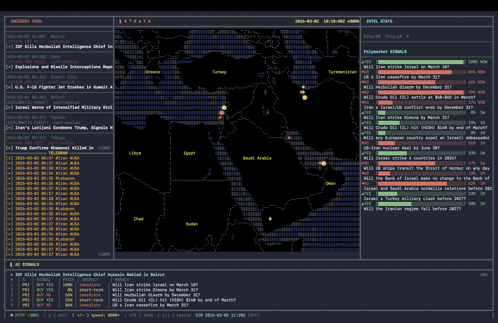

# STRATA

**Real-time conflict intelligence → market signals → automated trading**

STRATA turns live conflict news (from Telegram/News channels) into structured events, maps them to Polymarket prediction markets, and can execute trades automatically using the Polymarket API. Everything appears in a single live terminal dashboard: incidents, a world map, AI trade signals, and execution history.

---

## What It Does

When something happens—a strike near a port, an escalation, a diplomatic move—markets can take minutes or hours to react. STRATA shortens that gap:

- **Ingests** messages from conflict-focused Telegram channels (with translation and filtering).
- **Analyzes** them with AI to extract events: what happened, where, who’s involved, confidence.
- **Maps** those events to active Polymarket questions and ranks trade ideas by urgency.
- **Shows** everything in a live terminal UI: feed, map, signals, and (optionally) places orders via the Polymarket API.

By the time a headline hits the news, the position can already be in the market.

---

## What You’ll See

When you run the dashboard (`node strata.js`), you get:



**Watch a demo:** [](https://www.youtube.com/watch?v=HTOp1nyrzwI)

| Area | What’s there |
|------|----------------|
| **Left — Incident feed** | AI-summarized events (headline, type, location, confidence) and live Telegram messages. Expand/collapse with **[+]** / **[-]**; scroll to see more. |
| **Center — Map** | ASCII world map with **red dots** at event locations. **Click a dot** to open a popup with headline, summary, and link. Pan with arrow keys. |
| **Right — Intel stats** | Counts of events, countries, and trade signals. Portfolio P&L when connected. |
| **Bottom — AI signals** | Polymarket trade ideas (market, side, urgency) from the latest analyzed events. Scroll to see more. |
| **Status bar** | Connection status, controls reminder, and (in replay mode) simulated time and speed. |

**Replay mode:** If you run the pipeline with a start date (e.g. `resume.py --since 2026-02-27`), the dashboard can replay events over time at an accelerated speed so you can watch the feed and map update as if in real time.

---

## Controls

| Action | Key / gesture |
|--------|----------------|
| Exit | **x** |
| Zoom map in / out | **z** / **Z** |
| Resize left panel (AI vs Telegram) | **[** / **]** |
| Replay speed (when using `--since`) | **+** / **-** |
| Scroll incident feed (top left) | Mouse wheel or scroll in that panel |
| Scroll Telegram section | Mouse wheel in Telegram area |
| Scroll AI signals (bottom) | Mouse wheel in bottom panel |
| Expand / collapse event or Telegram message | **Click** the **[+]** / **[-]** row |
| Event detail on map | **Click** a red dot |
| Dismiss popup | Click anywhere |
| Media (if available for an event) | **m** when a popup is open |

---

## Getting Started

### You need

- **Node.js** 18+
- **Python** 3.10+
- **Telegram** API credentials ([my.telegram.org](https://my.telegram.org) → API development tools)
- **Anthropic** API key ([console.anthropic.com](https://console.anthropic.com))
- **Polymarket** wallet private key only if you want real trading (otherwise everything runs in dry-run).

### Install and configure

```bash
# From the project root
npm install

cd telegram_scraper
pip install -r requirements.txt
cp .env.example .env
```

Edit `.env` and set at least:

- `TELEGRAM_API_ID`, `TELEGRAM_API_HASH`, `TELEGRAM_PHONE`
- `ANTHROPIC_API_KEY`

For live trading, add `POLY_PRIVATE_KEY` (and optionally `POLY_ORDER_SIZE`, `POLY_MIN_URGENCY`).

The first time you run the scraper, Telegram will send a login code to your phone; enter it when prompted.

### Run the dashboard

```bash
node strata.js
```

The TUI starts and listens on port **3001**. With no pipeline running, you’ll see the layout and “All systems running”; once the Python pipeline is running (scraper + analyzer, and optionally trade executor), events, map dots, and AI signals will stream in.

### Optional: run the full pipeline

From another terminal:

```bash
cd telegram_scraper

# One-shot: process from a start date (good for replay)
python resume.py --since 2026-02-27

# Live: scrape + analyze + optional trading (dry-run by default)
python main.py --backfill 200
```

The dashboard will show events and signals as they’re produced. Use `--live` with `main.py` or `resume.py` only when you want real Polymarket orders.

---

## Summary

- **STRATA** = Telegram conflict intel → AI events → Polymarket signals (and optional execution), all in one terminal UI.
- **Run** `node strata.js` to open the dashboard; run the Python pipeline in another terminal to feed it.
- **Use** the left panel for the feed, the map for geography, the bottom for trade ideas, and the status bar for controls and replay speed.

*Built at B&B Hacks 2026*
